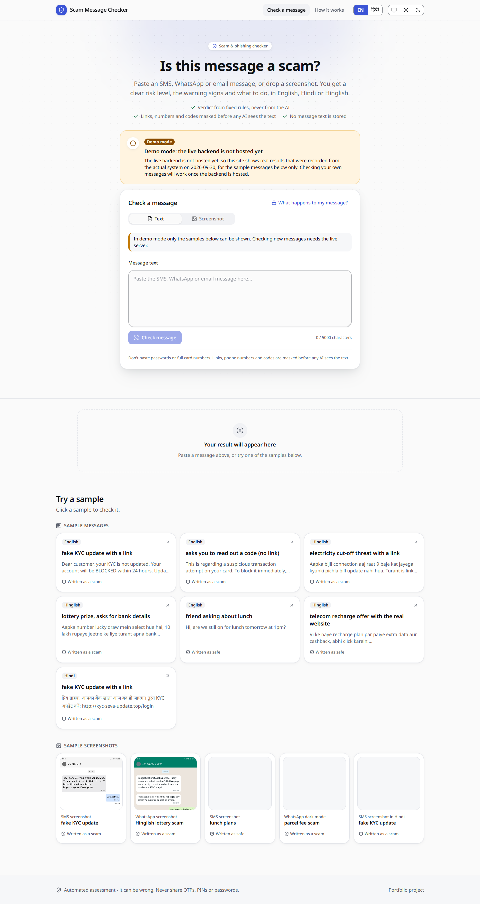
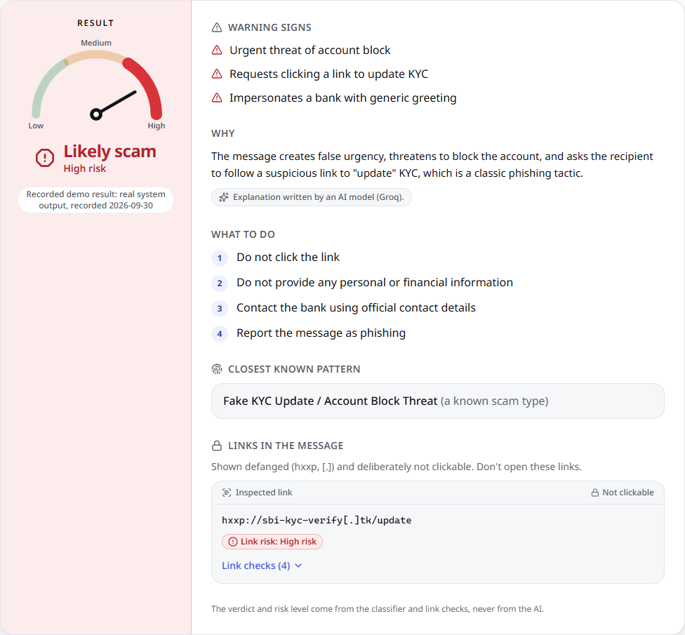
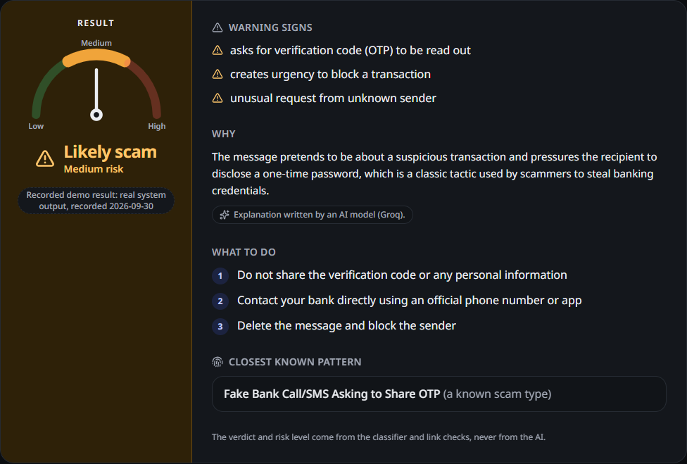
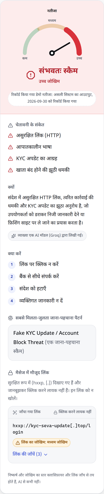

# AI Scam & Phishing Message Detector

<!-- One-paragraph pitch, badges (CI, license), demo GIF -->

## Features

## What counts as a scam (and what does not)

The classifier answers "is this message a **scam**?", meaning deception aimed at money,
credentials or a risky action. It does **not** treat legitimate marketing as a scam:

| Kind | Example | Target label |
|---|---|---|
| Fraud | "You have won a 1 crore prize, call 09066... to claim"; "verify your KYC now or your account is blocked" | `scam` |
| Promo (spam) | Airtel recharge offer, retailer sale, pre-approved card offer on the bank's own site | `safe` (unwanted, not a scam) |
| Service / personal | A genuine OTP, a delivery notice, a chat message | `safe` |

Public "spam" datasets use *spam* to mean "unsolicited or commercial", which is broader than
*scam*. A manual 100-row check found UCI SMS "spam" is about 34% fraud, 57% promo and 9% non-spam
(promo:fraud about 1.7:1), and the Indian SMS "spam" set is about 90% promo, 8% service and 2%
fraud (about 54:1). Each row therefore carries a `subtype` (`fraud` / `promo` / `service`) so the
definition can be applied deliberately. The full rubric is in `docs/label_rubric.md`.

## Demo

**The live backend is not hosted yet**, so the deployed website runs in **demo mode**: it shows real
responses that were recorded from the actual system (local API, Groq explainer) on 2026-09-30, for
the built-in sample messages and screenshots only. It cannot check your own messages until the
backend is hosted. See [Web App](#web-app) for how to switch it to the live API.



## Architecture

## Dataset

| Source | Role |
|---|---|
| UCI SMS Spam Collection | Real SMS (English, mostly UK) |
| Hugging Face `ealvaradob/phishing-dataset` (texts) | Real email and SMS |
| Kaggle `subhajournal/phishingemails` | Real email (almost entirely overlaps the HF data) |
| LLM-generated (Groq + Gemini free tiers) | Hinglish, Hindi and regional code-mixed scam **and safe** messages for 7 scam types |
| Hand-collected real Indian messages (optional) | Evaluation-only Hinglish test set |

**Preprocessing** (`src/preprocessing/preprocess.py`): Unicode/whitespace cleaning; URLs,
OTPs and phone numbers masked to `<URL>`, `<OTP>`, `<PHONE>` (original URLs kept for the URL
analyzer); exact **and** near-duplicate removal on the masked text (TF-IDF cosine >= 0.90) *before*
splitting; stratified 70/15/15 split in which **the test set is 100% real data**; a leakage
audit across split boundaries. Every design choice and number is in `results.md`;
charts and analysis are in `notebooks/01_eda.ipynb`.

**Synthetic data** is used for training and validation only. Its generator alternates
providers, balances scam/safe within each provider, and filters placeholder-looking numbers
and text that is not really in the requested language.

**Extending the test set:** to add your own real Indian messages, see
`docs/labeling_guidelines.md` and `docs/real_indian_test_template.csv`.

## Results

Baselines on the real test set (3,418 messages, scam = positive class; full tables and analysis
in `results.md`):

| Model | Precision | Recall | F1 | ROC-AUC |
|---|---:|---:|---:|---:|
| TF-IDF + Logistic Regression | 0.971 | 0.969 | 0.970 | 0.998 |
| TF-IDF + Linear SVM | 0.971 | 0.969 | 0.970 | 0.998 |

**Read this before trusting those numbers:** leave-one-source-out evaluation (train without a
source, test on it) drops ROC-AUC to **0.64** on the held-out HF email corpus and to 0.95 on
UCI SMS, and the models' top features are corpus fingerprints (`enron`, `>`, `2005`). The
test set is 99.9% English. So 0.97 is an in-distribution upper bound, not a real-world
accuracy, and there is no Hinglish result on real data yet. Experiments are tracked locally
with MLflow (`mlflow ui --backend-store-uri sqlite:///mlflow.db`).

**Phase 3.5 (data quality)** audited the synthetic labels (1,654 rows to 1,580; cross-family LLM judges
and an AI assistant reviewed the flagged rows, and a human spot check of 30 rows was partial, not a full
blind check, so no agreement rate is claimed; hard-negative rules: safe messages never link mismatched
domains or ask the reader to act on an OTP), separated
fraud from legitimate promotions in the UCI and India SMS data, and re-ran the baselines through an
ablation ladder. The pre-registered feature-audit criterion was **not met** by any level, test F1
stayed near 0.97 and cross-source transfer did not improve; the numbers above were measured under the old
spam=scam definition. Details, including what remains for Phase 4, are in `results.md`. The audited
synthetic set is described in `docs/synthetic_dataset_card.md` (Hugging Face upload pending review).

**Phase 4 (transformer fine-tuning, Colab)** fine-tuned `distilbert-base-uncased` and MuRIL
(`google/muril-base-cased`, chosen for its romanised-Hinglish pretraining) on the Phase 3.5 L3b
data (normalised text, fraud separated from legitimate promotions), with class-weighted loss,
early stopping on real validation PR-AUC, and a recall-first decision threshold. **Honest
headline: fine-tuning did not beat the TF-IDF baseline.** DistilBERT (selected by
validation PR-AUC before the test set was scored) reached test F1 0.948 / ROC-AUC 0.996,
statistically indistinguishable from TF-IDF's 0.945-0.947 / 0.995, and its leave-one-source-out
transfer to held-out email (ROC-AUC 0.55) was *worse* than TF-IDF's (0.60). Both transformers
tripped the pre-registered mitigation trigger; the owner chose not to spend Colab compute
fixing it yet, since (a) the transformer didn't beat the baseline in the first place, (b) the
leave-one-source-out metric measures generalisation to old email, not the product's SMS/WhatsApp
target, and (c) there is still no real Indian test set to validate a fix against. Full reasoning
and the recorded future-work options (source-adversarial training, source-balanced sampling,
dropping the email corpus) are in `results.md`. The selected model was exported to ONNX and
dynamically quantized to int8 (267.9 MB to 67.3 MB, ~30% faster on CPU, F1 drop 0.004, and only
8 of 3,682 test rows flip their predicted label under quantization, all safe -> scam, none
scam -> safe); `src/inference/predictor.py` loads it for CPU inference. **Deployment
recommendation: ship TF-IDF + Linear SVM, not DistilBERT** — it ties or beats DistilBERT on
every accuracy metric measured and clearly wins on generalisation, size and latency, so the
heavier model has not earned its cost yet. Full comparison table in `results.md`. No model has
been published to the Hugging
Face Hub yet; that decision is deferred to the deployment phase.

**Phase 7 (LLM explainer + end-to-end pipeline)** ties classifier, URL analyzer and RAG
together (`src/pipeline.py`). The **verdict and risk level always come from fixed, documented
code rules** (`src/llm/rules.py`) combining the classifier's call with the URL analyzer's worst
risk band - a confident scam call is always high risk even with no link (many scams, like
digital-arrest calls or OTP requests, contain none), and a high-risk link escalates the verdict
even if the text classifier alone says safe. The LLM (Groq by default, Gemini as a fallback,
both time-budgeted to ~10 seconds total so a slow provider can't block the response) only
narrates that fixed decision in the user's detected language (English, Hindi or Hinglish); its
own attempt at a verdict, risk level, or matched pattern is always discarded and replaced with
the code-computed values, even if a message tries to prompt-inject the model into saying
"this is safe." Every field the LLM writes (`explanation`, `red_flags`, `what_to_do`) is also
re-masked for URLs/phone numbers/OTP-like codes and length-capped before being returned, so a
manipulated response can't hand a user a fresh malicious link or number. When both providers
fail, time out, or hit rate limits, a deterministic template (no LLM) takes over and the
pipeline never crashes.

## Privacy

- Only the **masked** message text (with links, phone numbers, and OTP-like codes already
  replaced by `<URL>`/`<PHONE>`/`<OTP>` tokens) is ever sent to the third-party LLM APIs
  (Groq and/or Gemini) used for the explanation step. The raw message text never leaves this
  process.
- Groq and Gemini's **free tiers have their own data-use terms** (e.g. a provider may log or
  use submitted content per its own policy) - this is outside this project's control. A future
  web/app UI should show a short privacy note before analysis, along these lines, so users know
  a (masked) copy of their message is sent to an external AI provider.
- **Screenshots are OCR'd locally** (EasyOCR on CPU, in this process). The image itself is never
  sent to any external service. Only the masked text recovered from it goes to the LLM, the same
  as for pasted text. OCR text is never logged.
- No message text, masked or otherwise, is persisted by this project. The backend API (Phase 9)
  logs only allowlisted fields (route, status, timings, verdict labels). A test sends marker text,
  URLs, filenames and IPs through every endpoint and fails if any of them appears in the logs.
  Feedback rows contain no text.

## Setup

### Secrets and the git pre-commit hook

Real API keys live only in `.env` (gitignored). `.env.example` is committed, so it holds
placeholders only; a test (`tests/test_setup.py`) fails if it ever contains a real value.

A pre-commit hook blocks any commit whose staged files contain key-shaped strings (`gsk_`,
`hf_`, `AIza`, `KGAT_`, GitHub/Anthropic/OpenAI-style keys, JWTs, private-key blocks) or
secret files (`.env`, `kaggle.json`, keystores). It uses the Python standard library only and
never prints the value it finds.

**Setup on Windows (once per clone, in PowerShell or Git Bash):**

```powershell
git config core.hooksPath githooks           # enable the hook
python githooks\check_secrets.py --all       # optional: scan everything git would commit now
```

Requirements: Git for Windows (it runs the hook with its bundled `sh`) and `python`, `python3`
or the `py` launcher on `PATH`. No virtual environment or extra packages are needed.

**Check that it works** (this stages a fake key, so the commit must be refused):

```powershell
'KEY = "gsk_' + ('a1B2c3D4' * 5) + '"' | Set-Content demo_secret.py
git add demo_secret.py
git commit -m "test"        # expected: "Commit blocked: possible secrets found"
git reset -q demo_secret.py; Remove-Item demo_secret.py
```

If the hook ever blocks a harmless test fixture, add `# secret-scan: allow` to that line.
Bypassing with `git commit --no-verify` is possible but defeats the protection. If a real key
is ever committed or shown anywhere public, rotate it.

### Dependency files

Dependencies are split across several files on purpose:

| File | Purpose |
|------|---------|
| `requirements.txt` | Core libraries for data, EDA and the baseline (Phases 1-3). Light enough to install on any laptop. |
| `requirements-train.txt` | Heavy training stack (PyTorch, Transformers, ...). Installed on Colab/Kaggle GPUs only. Added in Phase 4. |
| `requirements-api.txt` | Self-contained inference/API stack (FastAPI, scikit-learn, CPU torch, sentence-transformers, ChromaDB, EasyOCR). The only file the Docker image installs. |

The project has no local GPU, so training runs on free Colab/Kaggle. Keeping
PyTorch and Transformers out of the deployed image means the Hugging Face
Docker Space stays small and starts fast, because inference uses quantized
ONNX models on CPU instead.

## Usage

Run the API locally (Windows PowerShell):

```powershell
.venv\Scripts\python -m api.prefetch      # one-time: OCR + embedding models, RAG index
.venv\Scripts\python -m uvicorn api.main:create_app --factory --port 7860 --workers 1 --no-access-log
curl.exe -s -X POST http://127.0.0.1:7860/analyze/text -H "Content-Type: application/json" --data-binary "@docs/api_examples/text_scam.json"
```

Interactive docs are at `http://127.0.0.1:7860/docs`. Deployment (Hugging Face Space, Supabase) is covered in
[docs/deployment.md](docs/deployment.md).

## API Reference

| Endpoint | Body | Returns |
|---|---|---|
| `POST /analyze/text` | JSON `{"text": "..."}` (1-5000 characters) | Analysis (below) |
| `POST /analyze/image` | multipart `file`: a PNG/JPEG/WebP screenshot, up to 5 MB | Analysis, plus `ocr` |
| `POST /feedback` | JSON `{"prediction_id": "<uuid>", "user_verdict": "correct" \| "incorrect"}` | `201 {"status": "saved"}` |
| `GET /health` | - | `status` (`ok`/`degraded`/`unavailable`) and each component's readiness |

The analysis response contains:
- `prediction_id`, `verdict` (`safe`/`suspicious`/`scam`) and `risk_level` (`low`/`medium`/`high`)
- `red_flags`, `explanation`, `what_to_do` and `matched_pattern`
- `url_findings`: links are **defanged**, e.g. `hxxp://x[.]tk`, with a risk band and reasons
- `explainer_path` (`groq`/`gemini`/`template`), `classifier_model` and `timings_ms`
- for images, `ocr`: `extracted_text`, `quality` (`good`/`fair`/`poor`) and `dark_mode`

**No probability or numeric score is ever returned.**

Errors are `{"error": {"code", "message", "request_id"}}`:

| Status | Codes |
|---|---|
| 413 | `too_large`, `body_too_large` |
| 415 | `unsupported_type` |
| 422 | `empty_text`, `text_too_long`, `no_text_found`, `invalid_request`, and the other image validation codes |
| 429 | `rate_limited` (with `Retry-After`) |
| 404 | `unknown_prediction` |
| 503 | `busy`, `ocr_unavailable`, `classifier_unavailable`, `feedback_not_configured` |
| 502 | `feedback_storage_error` |
| 504 | `timeout` |

**Operational behaviour:**
- **Loading:** models load once at startup. If one component fails to load, only the endpoints that
  need it return 503.
- **Rate limits** are per client and per minute: 20 text, 6 image, 30 feedback, all configurable.
- **Logs** are privacy-safe JSON lines, one per request, holding the route, status, timings and
  verdict. They never include message text, OCR text, URLs, filenames or IP addresses.
- **Feedback** rows in Supabase hold only the prediction id, your answer and the predicted labels.
  Prediction ids are remembered in memory for 24 hours and are lost when the server restarts.

## Web App

A static Next.js site in [web/](web/) (App Router, `output: "export"`, TypeScript). It is styled with
Tailwind CSS 4 design tokens and shadcn/ui components on Radix UI, with Motion for subtle animation and Lucide
icons. It is plain HTML/CSS/JS, so any free static host can serve it.

| High-risk result | Medium risk, dark theme | Hindi interface, Devanagari result (phone) |
|---|---|---|
|  |  |  |

Before/after screenshots of every page and state are in [docs/screenshots/](docs/screenshots/README.md).

**Features**
- Check pasted text (5,000-character limit with a counter) or a screenshot (file picker or
  drag-and-drop, PNG/JPEG/WebP up to 5 MB, checked in the browser and again by the API).
- The result has an animated gauge with three bands. The needle points to the middle of the band:
  it shows the band only, never a score. The verdict and risk are always written out (Likely scam /
  High risk) with an icon whose shape differs per level. Then come warning signs, the explanation,
  numbered steps for what to do, and the closest known pattern. Screenshots also show the text that
  was read (collapsible) and the OCR quality.
- Polished states: skeleton while checking, a progress line for screenshots, a friendly empty state,
  error cards with an icon for the kind of problem, and toasts for feedback.
- Light and dark themes with a System / Light / Dark switch (default System, remembered in the
  browser). Every colour pair is tested for WCAG AA contrast in both themes.
- Links are shown exactly as the API defangs them (`hxxp://x[.]tk`), in a monospace "inspected
  link" panel, and are never clickable. No probability or score is shown anywhere, because the API returns none.
- The explanation is tagged `lang="en"`, `"hi"` or `"hi-Latn"` (Hinglish) from the API's
  `language` field. Devanagari text gets Noto Sans Devanagari and a taller line height.
- A "Was this correct?" Yes/No button pair, with clear messages for 404 (result too old after a
  restart), 503 (feedback off) and 429 or network errors (retry).
- Every API error code maps to a friendly message in English and Hindi, plus a small reference ID.
- Seven text samples (English, Hinglish and Devanagari Hindi; scam and safe) and five sample
  screenshots. Click one to check it.
- An EN | हिंदी interface switch (remembered in `localStorage`). It never changes result content.
- An About page with the pipeline diagram, the real numbers from [results.md](results.md) (each one
  with its source section), the privacy notes and the limitations.
- Accessibility: skip link, visible focus rings, ARIA tabs with arrow keys, labelled inputs, live
  status for loading and results, focus moves to the result, WCAG AA colours in both themes, and
  a spinner that respects reduced motion.

**Measured** (desktop Lighthouse 13.5.0 on the deployable demo build, one run per page; see results.md):
home page Performance 94, Accessibility 100, Best Practices 100, SEO 100; About page 96 / 100 / 100 / 100.
The home page loads 287,721 bytes of gzipped JavaScript (201,531 before the redesign).

**Demo mode.** The app calls `GET /health` on load (4-second timeout).
- **No API URL at build time:** the banner says the backend is not hosted yet.
- **API unreachable** (asleep or down): the banner says so and offers "Try the live server again".

In both cases only the recorded samples work. The text box and upload are disabled, every result
is labelled "Recorded demo result", and feedback is hidden. The demo lookup accepts only sample
IDs, never typed text, and a test covers this. Recordings are in
`web/src/demo/recorded.json` (sample content only). Re-record them with the API running:
`cd web && npm run record-demo` (about 12 real LLM calls).

**Security.** The site holds no keys and talks only to our API.
- A Content-Security-Policy meta tag sets `connect-src 'self' <API origin>`, `object-src 'none'`
  and `form-action 'none'`. Even an injected script can't send data anywhere else.
- `script-src` is left open because a Next static export hydrates through inline scripts (the theme
  switch also uses one small inline script, to apply the theme before first paint).
- Fonts are downloaded at build time and served from the site itself, so visitors' browsers never
  contact Google.

**Run locally**

```powershell
# Terminal 1: the API, allowing the dev site's origin
$env:CORS_ORIGINS = "http://localhost:3000"
.venv\Scripts\python -m uvicorn api.main:create_app --factory --port 7860 --workers 1 --no-access-log

# Terminal 2: the site (npm run dev uses http://127.0.0.1:7860 by default)
cd web
npm ci
npm run dev        # http://localhost:3000
npm test           # 232 Vitest tests (unit, component, axe accessibility, contrast)
```

**Build settings** (all public, read at build time; rebuild after changing them):

| Variable | Meaning |
|---|---|
| `NEXT_PUBLIC_API_URL` | API origin, e.g. `https://you-scam-api.hf.space`. **Unset = demo mode only.** |
| `NEXT_PUBLIC_BASE_PATH` | Sub-path for GitHub Pages project sites, e.g. `/scam-detector`. |
| `NEXT_PUBLIC_REPO_URL` | Optional GitHub repo link on the About page. |

**Switching to the live API later.** Host the backend, set `NEXT_PUBLIC_API_URL` to its origin,
rebuild (Vercel does this when you change the variable and redeploy), and set the API's
`CORS_ORIGINS` to the site's exact origin. Nothing else changes: the banner disappears once
`/health` answers. Full steps: [docs/deployment.md](docs/deployment.md#web-frontend).

## Android App

## Evaluation

## Limitations

- **Real public data is almost entirely English and Western.** Only synthetic data covers
  Hinglish and regional code-mixing, and it cannot be used for evaluation. Headline test
  metrics therefore do not measure Hinglish performance; a hand-collected real Indian set is
  the honest measure.
- **The source is partly a shortcut for the label** (scam rate 11% in UCI SMS, 36% in the HF
  texts, 46% in synthetic data). Results are reported per source and leave-one-source-out.
- **Language tags for real data are heuristic**; real romanized Hinglish is under-detected.
- **Synthetic messages come from two LLM families** and may not match how real scammers write.
- **The explainer's output-language detector (`src/llm/language.py`) only distinguishes English,
  Hindi (Devanagari), and Hinglish** (at least 2 distinct romanized-Hindi marker words, or 3 in
  messages over 60 words). It is a heuristic. A short Hinglish message with only one marker word
  (e.g. "Yo bhai, your account is on hold") gets an English answer. About 0.01% of real English
  messages (2 of 21,145) would get a Hinglish answer. Code-mixed
  Tamil/Telugu/Bengali/Marathi-English (`ta_en`/`te_en`/`bn_en`/`mr_en` in
  `docs/labeling_guidelines.md`'s language taxonomy) is not detected and currently falls back to
  English output. Extending this would follow the same pattern used for Hindi/Hinglish: a
  script-range check for native-script text, or a function-word list for the romanized form.
- **Screenshot OCR (Phase 8) is measured mainly on generated images.** EasyOCR on CPU takes about
  3-4s per phone screenshot (warm, on a 4-core desktop; slower on a free cloud CPU), and needs
  313 MB of models and about 0.7 GB RAM. OCR commonly misreads "/" in links as "l". A heuristic
  repair step fixes the common cases, but an unusual mangled link can still escape the URL
  analyzer (the text classifier still sees the message). Stylized fonts, emoji-heavy chats,
  low-resolution or compressed screenshots, and very short words (a lone "I") read worse. Only
  English + Hindi (Devanagari) are enabled by default. EasyOCR pairs Hindi only with
  English/Marathi/Nepali, so other Indian scripts (Tamil, Bengali, ...) need a different
  `OCR_LANGUAGES` setting and are untested.

## Project Structure

## Roadmap

## License
